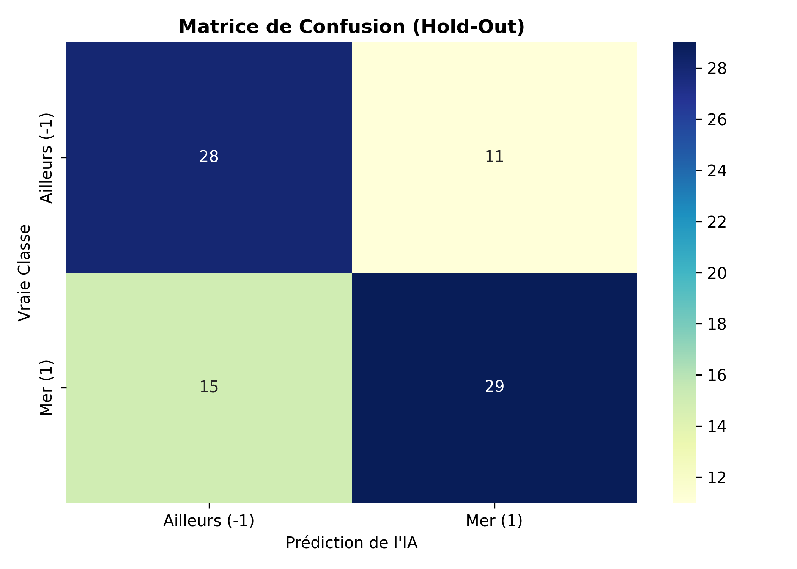

#  Sea Classifier : Modèle de Vision par Ordinateur (Machine Learning)

**Auteur :** Alassane POUYE | Étudiant L3 Mathématiques-Informatique
**Technologies :** Python, Scikit-Learn, NumPy, PIL, Seaborn
**Domaines :** Computer Vision, Feature Engineering, Classification Probabiliste

##  Objectif du Projet
Conception et développement de bout en bout d'un pipeline de **Machine Learning** capable de classifier des images selon qu'elles représentent un environnement marin ("Mer") ou un autre paysage ("Ailleurs"). Ce projet démontre ma capacité à manipuler des données brutes, à extraire des signaux mathématiques et à déployer un modèle prédictif robuste.

## Architecture et Approche Mathématique

Plutôt que d'utiliser des modèles pré-entraînés (Deep Learning), j'ai fait le choix de développer un algorithme basé sur l'extraction manuelle de caractéristiques (Feature Engineering) combiné à un modèle probabiliste :

1. **Feature Engineering (Extraction RGB) :** Séparation des canaux de couleurs des images. L'algorithme isole les canaux et génère des histogrammes spécifiques (Focus Bleu, Focus Rouge/Vert) pour forcer le modèle à capter la colorimétrie marine.
2. **Data Augmentation :** Implémentation d'une fonction de symétrie horizontale (Flip) appliquée **uniquement sur le jeu d'entraînement** pour doubler la taille du dataset sans provoquer de *Data Leakage*.
3. **Modélisation Probabiliste :** Utilisation d'un algorithme **Gaussian Naive Bayes** basé sur le théorème de Bayes, particulièrement adapté pour des features continues comme les histogrammes de pixels.

##  Évaluation et Performances

Afin de prouver la robustesse du modèle et l'absence d'overfitting, deux méthodes d'évaluation ont été implémentées :
* **Hold-Out (80/20) :** Erreur estimée à ~31% (Accuracy globale de 69%).
* **Validation Croisée (8-Folds) :** Erreur moyenne de ~30.5%.

La convergence de ces deux métriques prouve que le modèle généralise de manière optimale sur des données non vues.

*(Aperçu de la matrice de confusion générée via Seaborn évaluant les faux positifs/négatifs).*

##  Déploiement (MLOps)
Le projet intègre des bonnes pratiques de production :
- Suivi de l'exécution via barres de progression (`tqdm`).
- Génération automatique de rapports de classification (Precision, Recall, F1-Score).
- Sauvegarde du modèle entraîné au format `.pkl` (via `joblib`) pour une intégration immédiate en API ou environnement de production.
